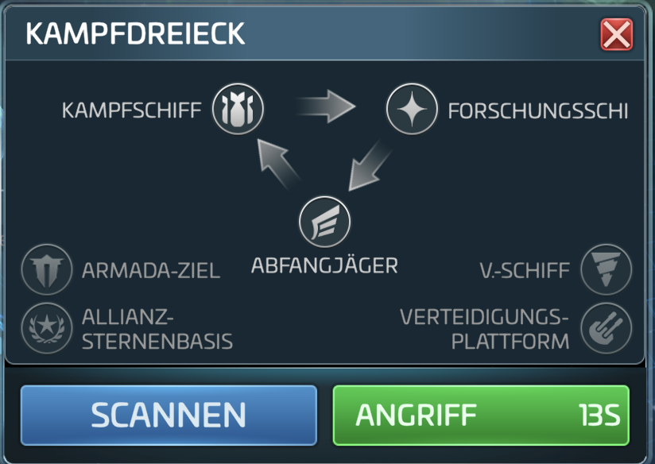

# Star Trek Fleet Command: Guide

<center>
    
</center>

STAR TREK FLEET COMMAND (STFC) ist mehr als nur ein Handyspiel. Es ist eine blühende Gemeinschaft von Spielern, die die Spielwelt um ihre eigenen Regeln, Politik, Kultur und Terminologie erweitert haben.

Um erfolgreich zu sein, musst du dich mit dieser zusätzlichen Spielebene vertraut machen. Wenn du sie beherrschst, hast du die Möglichkeit, deine eigenen Ergänzungen einzubringen und der Galaxie deinen Stempel aufzudrücken.

## Disclaimer

Dieser Text ist eine inoffizielle Übersetzung der englischen Version von <https://www.pvptarget.com/guide>

Bei Fragen oder Anregungen - Server EU 105 - Allianz GSW - Spieler C17E

## Aktuelle RoE auf Server EU 105

Diese Regeln gelten seit 16.07.2023 20:55

```text
* **0.1** - Northstar (Nordstern) ist als Kriegsschiff klassifiziert und genießt daher keinen Bergbauschutz.
* **0.2** - USS Discovery ist ein Schiff, das nur in Mycelium-Systemen Bergbau betreiben darf und den OPC Regeln unterliegt
* **1.0** Geschützte Schiffe
  * **1.1** Alle Vermessungsschiffe (Miner/Survey) sind geschützt, wenn UPC (_Under Protected Cargo_)
  * **1.2** Unter Bezugnahme auf Punkt 1.1 dürfen, wenn alle Knoten (_Mining-Nodes_) eines Systems besetzt sind, die auf Knoten mit 0 Ertrag (Zero-Nodes / leere Knoten) geparkten Schiffe angegriffen werden, um sie zu befreien. **Bedingung**: Der Angriff muss 2 Minuten vorher angekündigt werden. Außerdem muss der Angreifer auf Anfrage einen Screenshot des größten Teils des Systems vorlegen (da es schwierig ist, das System als Ganzes zu zeigen), um zu beweisen, dass alle Knoten (Mining-Nodes) zum Zeitpunkt des Angriffs besetzt waren.
  * **1.3** Unter Bezugnahme auf Punkt *1.1* sollen die Spezial-Bergbauschiffe nur die Ressourcen gewinnen, für die sie bestimmt sind: *Botany Bay* für die Daten (korrumpiert und dekodiert), der *Meridian* für die ISO (1, 2 und 3), *Ferenghi D'Vor* für Latinum, *Ferenghi D'Vor Feesha* für konzentriertes Latinum. Außerhalb des Verwendungszwecks haben die genannten Prospektoren keine RoE-Rechte.

* **2.0 Geschützte Räume**
  * **2.1** Alle Schiffe im Armadakreis sind in jedem Fall geschützt und dürfen nicht angegriffen werden!
  * **2.2** Alle Schiffe in Token Räumen sind UPC/OPC geschützt.
  * **2.3** Die Franklin ist im Schwarmraum UPC/OPC geschützt.

* **3.0** Territorien
  * **3.1** Wenn ein Territorium übernommen wird, können nur Allianzen, die die Gebühren/Resourcen bezahlt haben, das Territorium während der Übernahme betreten.
```

**Die aktuellesten Regeln stehen im Discord.**

## Einsatzregeln (RoE)

Die "Rules of Engagment" (RoE) sind ein selbst auferlegter Verhaltenskodex - von Spielern für Spieler entwickelt - in dem Bemühen, das Spiel für alle zu verbessern. Das Hauptziel der RoE ist es, die Interaktion zwischen den Spielern geordneter und weniger chaotisch zu gestalten, wenn es um Kriege, Bergbau, Raubzüge und das allgemeine Zusammenleben geht.

Das Grundprinzip von RoE ist als "**Fair Play**" bekannt. Griefing, Mobbing, Trolling, das Aufbrauchen von Ressourcen oder das anderweitige Berauben anderer Spieler von ihrem eigenen angemessenen Zugang und ihrer Möglichkeit, das Spiel zu genießen, stellen allesamt Verstöße gegen "**Fair Play**" dar und werden daher von RoE strikt abgelehnt. Das Ziel ist es, dass der Austausch so harmonisch und zivil wie möglich verläuft, selbst bei Konflikten.

Der Begriff "**Rules of Engagement**" ist ein wenig irreführend, da es keine offizielle Liste von "Regeln" gibt, die für alle Spielserver gelten. Vielmehr haben die führenden Allianzen der einzelnen Spielserver ihre eigenen Anpassungen der RoE, um ihre eigenen Interessen und Ziele zu verfolgen. Dennoch gibt es einige Kernkonzepte, die für das gesamte Spiel gelten und auf die wir hier näher eingehen werden. Diese grundlegenden, universellen Prinzipien von "RoE" sind als "Basis-RoE" bekannt.

Der größte Teil des Spielerjargons, dem du in **STFC** (und folglich auch in diesem Leitfaden) begegnen wirst, hat in der einen oder anderen Form mit der kontinuierlichen Entwicklung von RoE zu tun, also mach dich mit der RoE vertraut, die auf dem Server, auf dem du spielst, herrscht. Wenn du Mitglied einer Allianz bist, ist das der beste Ort, um zu fragen. Wenn du alleine spielst, frage im Spiel im **Galaxy Chat**.

**Seid gewarnt!** Auf jedem Server gibt es bestimmte Gruppen und Einzelpersonen, die sich offen gegen die RoE stellen. Vielleicht gehörst du sogar zu ihnen. Es ist wichtig, sich daran zu erinnern, dass die RoE eine Ehrenvereinbarung zwischen Spielern und NICHT die offiziellen Spielregeln sind.

## Geschützte Fracht

Jedes Raumschiff hat zwei verschiedene Laderäume, die der Reihe nach gefüllt werden:

* Der erste, kleinere Frachtraum ist für Ihre geschützte Fracht, die Ihnen NIE weggenommen werden kann, wenn Ihr Schiff angegriffen wird, selbst wenn es im Kampf völlig zerstört wird.
* Im zweiten, größeren Frachtraum wird der Rest der Ressourcen gelagert, die dein Schiff transportieren kann. In jedem Moment, in dem sich Ihr Schiff außerhalb des Schutzes Ihrer Station befindet, ist der Inhalt Ihres zweiten Frachtraums in ständiger Gefahr.

Überfallene Angreifer sind auf dem Vormarsch und wollen Ihnen Ihre hart verdienten Ressourcen wegnehmen. Seien Sie also auf der Hut! Das Stehlen von Ressourcen von anderen Spielern ist nicht nur legal und legitim, es wird sogar von den offiziellen Spielregeln gefördert und belohnt.

## Unter geschützter Ladung (UPC)

Wenn dein Schiff nur Ressourcen in deinem ersten geschützten Frachtraum transportiert und dein zweiter Frachtraum völlig leer ist, wird dein Schiff als "**UPC**" oder "**Under Protected Cargo**" bezeichnet.

Da ein Angreifer dir nichts von deiner Ladung wegnehmen kann, wenn dein Schiff UPC ist, wird dies unter RoE im Allgemeinen als "Kriegshandlung" angesehen. WARNUNG: Es gibt besondere Bedingungen, unter denen RoE den Angriff auf ein UPC-Schiff erlaubt. Die beiden häufigsten dieser Bedingungen sind "[Illegales Schiff](/glossar#Illegales Schiff)" und "[Nullknoten](/glossar#Nullknoten)".

## Übergeschützte Ladung (OPC)

Sobald Ihr geschützter Frachtraum voll ist, unabhängig davon, wie viel oder wie wenig mehr in Ihrem zweiten Frachtraum ist, wird Ihr Schiff als "**OPC**" oder "**Over Protected Cargo**" bezeichnet.

Wenn Ihr Schiff OPC ist, seien Sie auf der Hut. Sie transportieren wertvolle Waren, die andere Spieler nur zu gerne in die Finger bekommen würden. Unter fast allen Umständen ist das Angreifen eines OPC-Schiffs nicht nur erlaubt, sondern sogar erwünscht, sowohl durch die offiziellen Spielregeln als auch durch RoE. Alles, was über Ihre geschützte Fracht hinausgeht, ist zu haben, und je mehr OPC Sie besitzen, desto attraktiver sind Sie als Ziel. Bringen Sie sich mit Ihrer wertvollen Fracht so schnell wie möglich in die Sicherheit Ihrer Heimatstation.

Wenn Sie mit OPC überfallen werden, sollten Sie sich nicht blamieren.
Verteidige dich oder fliehe. **Jammere nicht. Dies ist ein Kriegsspiel.**


***PRO TIPP:*** Klicke auf ein beliebiges Schiff, um eine Einschätzung vor dem Angriff zu erhalten. Achten Sie auf das Feld REWARDS am oberen Rand des Dialogfeldes, das erscheint. Darin steht, was du bei einem erfolgreichen Angriff gewinnen würdest. Wenn die REWARDS-Box Bergbauressourcen enthält (Truhen zählen nicht), können Sie sicher sein, dass das Zielschiff OPC ist. Wenn hingegen keine Ressourcen in diesem Feld angezeigt werden, bedeutet das, dass der Spieler immer noch UPC ist... im Moment.

**Zur Erinnerung:** Unter den meisten Umständen ist der Angriff auf ein gültiges Schiff auf einem aktiven Knoten, der UPC ist, ein direkter Verstoß gegen die RoE. Eine solche Handlung kann einen galaktischen Konflikt auslösen.

## Gesetzmäßiger Angriff

Ohne RoE könnte jeder einfach auf dich zukommen und dich willkürlich angreifen, aus irgendeinem Grund oder ohne Grund. RoE versucht, ein gewisses Gleichgewicht und Ordnung in die Dinge zu bringen, aber RoE ist nicht dazu da, Konflikte zu verhindern. Es soll einen geordneten Konflikt ermöglichen.

Kriegsschiffe
Alle Schiffe, die das **Kampfdreieck** bilden - **Kampfschiff**, **Forschungsschiff** und **Abfangjäger** - werden unabhängig von der Fraktion ALLE als **Kriegsschiffe** eingestuft:



**Kampfschiff** schlägt **Forschungsschiff**. **Forschungsschiff** schlägt **Abfangjäger**, **Abfangjäger** schlägt **Kampfschiff**.

Warnung: **Unter Base RoE hat kein Kriegsschiff Schutz ... niemals**. Eigentlich ist es ganz einfach. Was auch immer Sie tun, wenn Sie es in einem Kriegsschiff tun, bereiten Sie sich auf einen Kampf vor.

## Illegales Schiff

**Der Abbau von Ressourcen sollte NIEMALS mit einem Kriegsschiff durchgeführt werden.** Die einzig gültige Raumschiffsklasse für den Abbau ist ein **Vermessungsschiff** (auch bekannt als **Mining Ship** oder **Surveyor**). Es ist nützlich zu wissen, dass Vermessungsschiffe auch schneller schürfen und mehr geschützte Ladung aufnehmen können, also solltest du dem Drang widerstehen, NIEMALS mit einem Kriegsschiff zu schürfen.

Wenn du dir aus irgendeinem unerfindlichen Grund in den Kopf setzt, dass es in Ordnung ist, mit einem Kriegsschiff zu schürfen, bereite dich darauf vor, beschossen zu werden. Es ist ein **illegales Schiff** und es ist unter RoE völlig legal, dich anzugreifen, **selbst wenn dein Schiff UPC ist**.

## Null-Knoten (oder Z-Knoten)

Beim Bergbau wird das "Weltraumgestein", auf dem Ihr Vermessungsschiff parkt, um Ressourcen zu gewinnen, als "Knoten" bezeichnet. Jeder Knoten meldet genau, wie viele Einheiten der Ressourcen dieses Knotens noch verfügbar sind. Der Knotenpunkt zählt abwärts, wenn Ressourcen abgebaut werden, bis er den Wert Null erreicht.

An diesem Punkt liegt es in **Ihrer Verantwortung**, entweder den Knotenpunkt zurückzusetzen (fliegen Sie vom Knotenpunkt weg und kehren Sie schnell zurück, wenn der Knotenpunkt zurückgesetzt wird und nicht mehr null Ressourcen anzeigt) oder weiterzuziehen, entweder zu einem anderen verfügbaren Knotenpunkt oder zurück zu Ihrer Heimatstation.

Wenn Sie Ihr Schiff auf einem Knoten verlassen, der Null erreicht hat, ohne den Knoten zurückzusetzen und ohne weiterzufliegen, nehmen Sie im Grunde JEDEM die Möglichkeit, diesen Knoten abzubauen und Ressourcen zu erhalten. Der Knoten ist nun ein Zero Node (oder Z-Node) und **Sie sind dafür verantwortlich**.

Einige Spieler werden dich höflich warnen, dass du ein Zero-Node bist, bevor sie dich in die Luft jagen, aber RoE gewährt dir diese Warnung nicht automatisch. Es gibt Spieler, die es als ihre Pflicht ansehen, Zero-Nodes in der ganzen Galaxie zu beseitigen. **Es spielt keine Rolle, ob du UPC bist.** Niemand mag die Vorstellung, dass ein perfekter Knoten auf diese Weise verschwendet wird.

Wenn Sie einen Knoten benötigen und jemanden am Steuer eines Nullknotens vorfinden, gewährt RoE Ihnen nicht nur die volle Erlaubnis, sondern auch den Segen, das Schiff in Stücke zu sprengen. Vergewissere dich aber, dass der Knoten Null anzeigt und sei vernünftig, wenn du dem Schiff erlaubst, sich zurückzusetzen. Viele belanglose Streitigkeiten wurden ausgelöst, wenn eine oder mehrere Parteien die Fakten nicht genau kannten. Wenn Sie ein Schiff wegen eines Nullknotens angreifen, sollten Sie einen Screenshot machen, bevor Sie den Angriff starten, für den Fall, dass Sie Ihre Ehre später verteidigen müssen.

## Knotenpunkt-Ninja

Da das Zurücksetzen eines Knotens bedeutet, dass man für einen kurzen Moment von ihm wegfliegt, bevor man wieder auf den Knoten zurückkehrt, haben sich einige hinterhältige Seelen eine Methode ausgedacht, um in einen bereits besetzten Knoten zu fliegen und darunter zu parken. Auf diese Weise sind sie zum Zeitpunkt des Zurücksetzens näher an dem Knotenpunkt als jeder andere und stürzen sich darauf, um ihn zu stehlen. Dieses raffinierte Manöver kommt vor allem dann zum Einsatz, wenn die Knotenpunkte stark ausgelastet sind und eine bestimmte Ressource stark nachgefragt wird.

Node-Ninjas werden von den meisten Allianzen als feindlich betrachtet. RoE kann Node-Ninja (auch bekannt als Ninja-Node) als Vergehen auf deinem Server einschließen oder auch nicht, aber tue es so oder so nicht. Es ist ein gruseliges, asoziales Verhalten, sich so an Fremde heranzuschleichen, und du solltest dich schämen.

Wenn du dich für einen Node interessierst, der gerade besetzt ist und kurz vor dem Reset-Punkt steht, solltest du dein Schiff nahe genug am Node parken, damit jeder sehen kann, dass du der Nächste sein willst.

Wenn der aktuelle Bewohner des Knotens beabsichtigt, den Knoten zurückzusetzen und den Abbau fortzusetzen, wird er Ihnen dies normalerweise mitteilen, damit Sie weiterziehen können. Betrachten Sie die Mining-Knoten wie die Kabinen in einer öffentlichen Toilette. Warten Sie in der Nähe, bis Sie an der Reihe sind. Verstecken Sie sich nicht hinter der Toilette und warten Sie nicht darauf, wie ein Freak zuzuschlagen.
